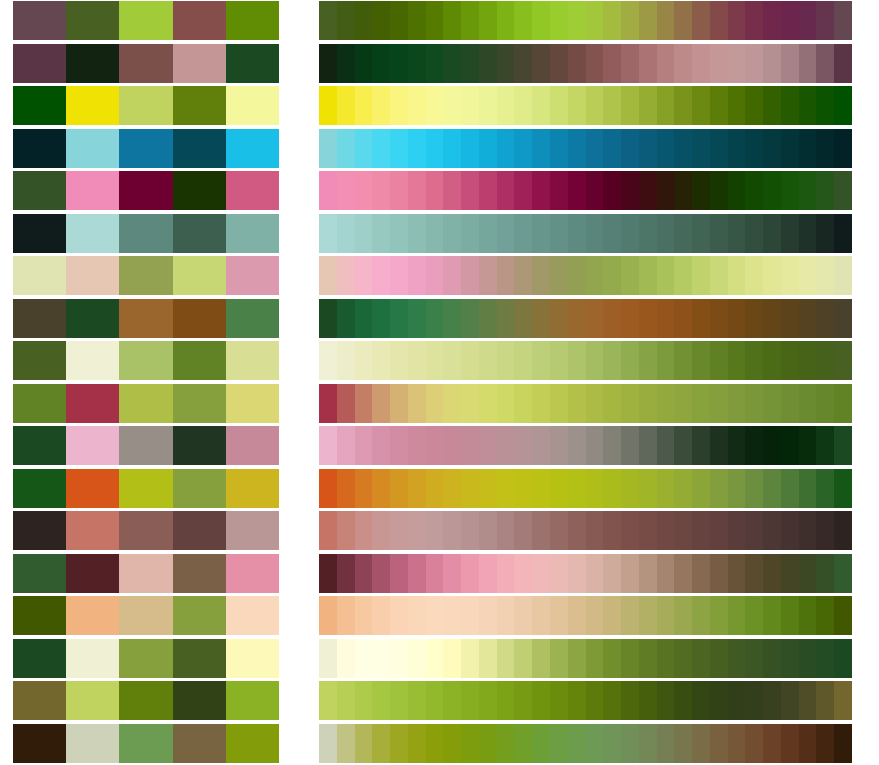

---
output: github_document
---

<!-- README.md is generated from README.Rmd. Please edit that file -->


```{r setup, include=FALSE}
knitr::opts_chunk$set(echo = TRUE)
```


### Color your plots by your favourite houseplant :herb:
The function provides 18 color palettes based on dominant or 'signature' colors of my favorite houseplants - or others with significant coloring.

**Disclaimer:** It is the nature of plants that most of them appear in shades of green and red, which is a problem for many people. So enjoy this package for your data exploration, but when sharing your results you might want to switch to more inclusive color palettes (e.g. 'viridis', 'okabe-ito'). 

Credits for the skeleton of the function go to [this blog](https://blog.devgenius.io/create-your-own-color-palette-function-in-r-64c8f21fc786).


{width=350px}


#### Example


```{r eval=FALSE}
source('plantcols.R')
data(iris)

# n=3 colors
pal<-plantcols(3, 'florida.ghost', cont=F)
ggplot(data=iris) +
  aes(x=Petal.Length, fill=Species) +
  geom_density(alpha=0.8) +
  scale_fill_manual(values=pal)

# 'cont=T' orders the colors for gradient
pal<-plantcols(3, 'florida.ghost', cont=T)
ggplot(data=iris) +
  aes(x=Petal.Length, fill=Species) +
  geom_density(alpha=0.8) +
  scale_fill_manual(values=pal)

# if n>5, n colors are imputed based on the 5 initial colors of the palette (left column in aboves image)
pal<-plantcols(20, 'raven.var', cont=T)
heatmap(as.matrix(mtcars), scale="column", col=pal, Colv=NA, Rowv=NA)
heatmap(data2, scale="column", col=pal, Colv=NA, Rowv=NA)
```
